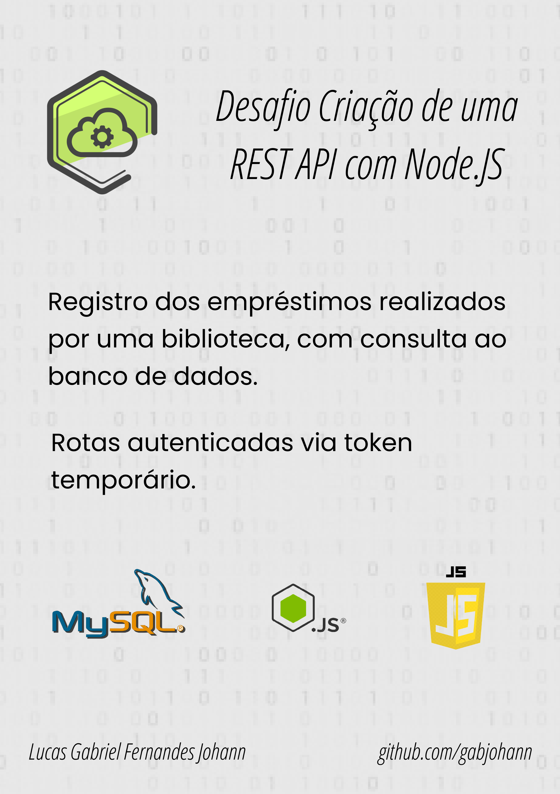

# API com Node.JS

<p align="center">
  <a href="#--sobre">Sobre</a> •
  <a href="#--funcoes">Funções</a> •
  <a href="#--tecnologias-utilizadas">Tecnologias Utilizadas</a> 
  </p>

  

  ## [](https://github.com/gabjohann/API_Node.JS#--sobre):page_facing_up: Sobre
  Estre projeto foi um desafio proposto ao aplicar para uma vaga de desenvolvimento. O intuito do desafio era testar as habiliades de pesquisa e proatividade.
  </br>
  O objetivo do desafio era a criação de uma API com Node.JS e  que houvesse algum tipo de autenticação.

  ## [](https://github.com/gabjohann/API_Node.JS#--funcoes) :dart: Funções
  Esta aplicação permite realizar CRUD em todas as rotas, ou seja, é possível cadastrar, consultar, alterar e deletar os livros, empréstimos e a lista de associados. Entretanto para realizar alterações nas rotas, se faz necessário se autenticar através de um token temporário gerada pela mesma.

  ## [](https://github.com/gabjohann/NLW06_beautysalon#--tecnologias-utilizadas)💻 Tecnologias utilizadas

### Aplicação
A API foi desenvolida utilizando:
  - SQL
  - JavaScript
  - Node.JS

### Ferramentas:
  - Editor de código: VSCode
  - MySQL Workbench: Desenvolvimento do Banco de Dados
  - Teste da API: Postman
  
### Utilização da API
  - clone este repositório
  - garanta que tenha instalado o node.js e npm na sua máquina, utilize ```node -v``` & ```npm -v``` para confirmar
  - caso não tenha, instale seguindo a documentação do mesmo
  - por fim, basta instalar os packages utilizados com o seguinte comando: ```npm install```

</br>
Observação: até o momento a aplicação só roda localmente, por tanto se faz necessário a utilização do navegador conectado via localhost ou via Postman para maior comodidade. 
